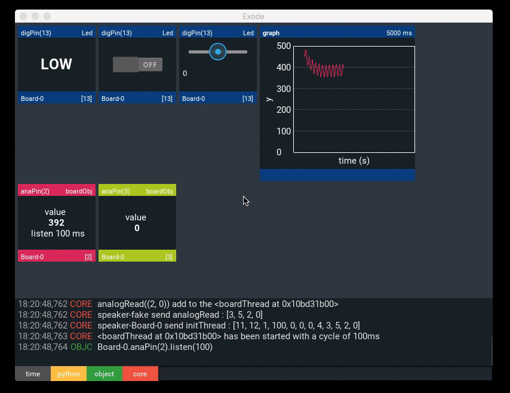
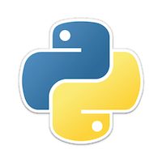

# Exode
*version : beta 0.4*

<p align="center"></p>
<p align="center"></p>
<p align="left"></p>
<p align="right"></p>


Python's library for communication between Arduino microcontroller boards and a connected computer. Write Python script and take control on your board using a serial IO.

```python
from Exode import *

uno = Board('/dev/tty.wchusbserial1420')
led = Led(13)

led.blink(500)
```

[Documentation](http://sne3ks.github.io/ExodeDoc/)

##  Fast and Intuitive

Exode was designed to simplify the development of Arduino projects. The library
take advantages from the clear and light Python's syntax.

Once your Arduino connected to your device (computer, Rasberry Pi, smartphone ..)
using a serial IO (usb/bluetooth), you're now allowed to have remote interactions
with your board.

You microcontroller become a simple slave, let your computer process the most
complex tasks. You may add artificial intelligence algorithm in your projects...

## Powerfull tools


Many of Arduino components are implemented in Exode, that's way you can directly
manipulate them with Python.

### User graphic interface

Interact with your object rapidly and simply through the Exode User interface.

> Control led13 with a switchBox

```python
from Exode     import *
from Exode.UI  import *

uno= Board('/dev/cu.wchusbserial1410')
led= Led(13)

switchBox= ExdSwitchBox(target=led, value="lvl")
radioBox = ExdRadioBox(target=led, title="Led13", value="lvl")

APP.STACK.add_widget(switchBox)
APP.STACK.add_widget(radioBox)
```

### Event-driven programming

Exode use event-driven programming to manage the interactions between the differents
components plugged on your board, or your computer it-self.

> Event with the HCSR04

```python
from Exode import *
uno = Board('/dev/tty.HC-06-DevB')

#Print the distance read by a HCSR04 every 1s

#Init the HCSR04
hcsr = HCSR04(echo=13, trig=12)

#Define a function to print the distance
def printValue():
    print(hcsr.cm+" cm")

#Attach the function to the event
hcsr.attachEvent('readInput', printValue)

#Launch the read every 1000ms (1s)
hcsr.read(1000)

>> 20.5 cm
>> 20.9 cm
>> 34.5 cm
>> ..

```
### Asynchronous Process

Furthermore, the Exode's kernel is based on a asynchronous processes,
greatly simplifying your project !!

> Blink two led asynchronously

```python

from Exode import *
uno = Board('/dev/tty.HC-06-DevB')

led13 = Led(13)
led14 = Led(14)

led13.blink(250)
led14.blink(500)

```
