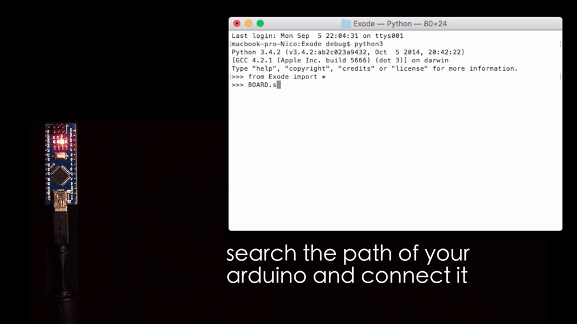
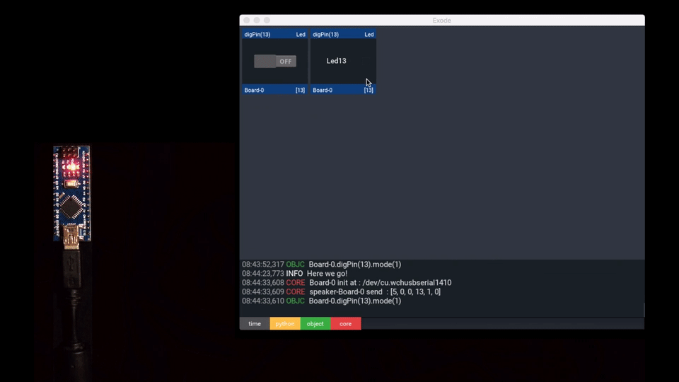

#Exode
*1.0.4*


<p align="center"></p>
<p align="center">Write Python scripts and take control of your Arduino board.</p>
<p align="center"></p>


```python
from Exode import *

uno = Board('/dev/tty.wchusbserial1420')
led = Led(13)
led.write(0)
led.write(1)
led.blink(500)
```

* [Installation guide](https://github.com/sne3ks/Exode/wiki/Installation-guide)
* [Documentation](http://sne3ks.github.io/ExodeDoc/)

> <span style="color:red;"><b>Exode still on the beta stadium, please signal your issues [here](https://github.com/sne3ks/Exode/issues) !</b></span>

## Rapid prototyping

Exode was designed to simplify the development of your Arduino projects. The library take advantages from the clear and light Python syntax.

Once your Arduino connected to your device (computer, Rasberry Pi, smartphone ..) using a serial IO (usb/bluetooth), you're now allowed to have remote interactions with your board. **Without having to compile your sources after each modification !**

You microcontroller become a simple slave, **let your computer process the most complex tasks**. Why not add artificial intelligence algorithm in your projects ?

## User graphic interface

Interact with your objects rapidly and simply through the Exode User Interface.

> Control led13 with a switchBox

```python
from Exode     import *
from Exode.UI  import *

uno= Board('/dev/cu.wchusbserial1410')
led= Led(13)

switchBox= ExdSwitchBox(target=led, value="lvl")
radioBox = ExdRadioBox(target=led, title="Led13", value="lvl")

APP.STACK.add_widget(switchBox)
APP.STACK.add_widget(radioBox)
```
<p align="center"></p>

## Event-driven programming

Manage interactions between the different components plugged on your board, or your computer it-self.

> Event with the HCSR04

```python
from Exode import *
uno = Board('/dev/tty.HC-06-DevB')

# Init the HCSR04 (ER ultrasound) and a Led
hcsr = HCSR04(echo=13, trig=12)
led  = Led(13)

# Define a control function
def control():
    if hcsr.cm() < 10:
      led.write(1)
    else:
      led.write(0)

# Bind the event to the function
# When hcsr is updated, control is called
hcsr.attachEvent('update', control)

# Read value every 100ms
hcsr.read(100)
```

## Multithreading

You're able to run differents tasks asynchronously on your board.

> Blink two led asynchronously

```python

from Exode import *
uno = Board('/dev/tty.HC-06-DevB')

led13 = Led(13)
led14 = Led(14)

led13.blink(250)
led14.blink(500)

# More tasks here..
```
